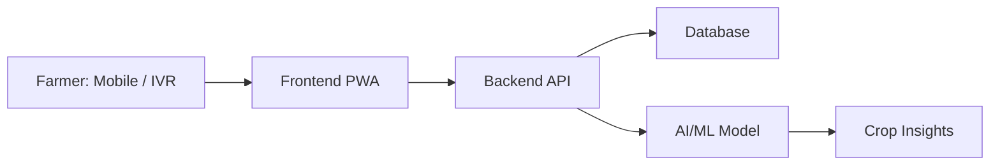
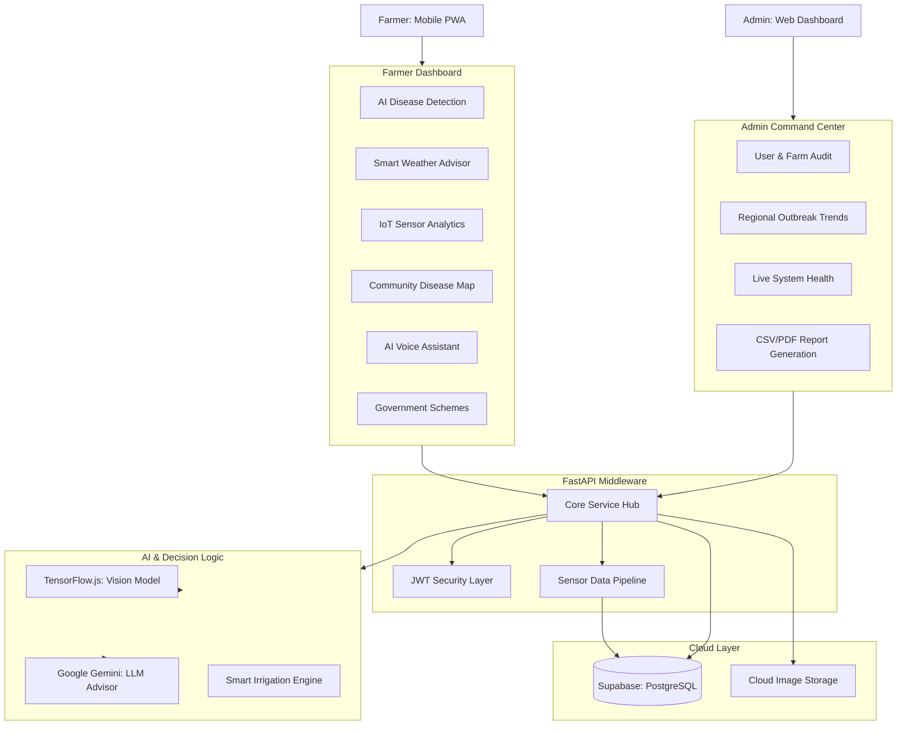

# 🌾 Krushit - AI & IoT Powered Smart Farming Assistant

### *Empowering Farmers with Intelligence, Connectivity, and Real-time Insights.*

[](https://nextjs.org/)
[](https://fastapi.tiangolo.com/)
[](https://supabase.com/)
[](https://deepmind.google/technologies/gemini/)
[](https://react.i18next.com/)
[](https://web.dev/progressive-web-apps/)

---

## 🌟 Overview

**Krushit** is a state-of-the-art **AgriTech** platform designed to bridge the gap between traditional farming and modern technology. By combining **Internet of Things (IoT)** sensors with **Artificial Intelligence (AI)**, Krushit provides farmers with a "Command Center" for their fields—accessible in their native language and available even on low-spec mobile devices as a PWA.

Our mission is to reduce crop loss, optimize resource usage (water/fertilizer), and provide actionable intelligence to the farmers of tomorrow.

---

## 🚀 Key Features

### 1. 🚜 Farm Command Center (Dashboard)
A unified interface where farmers can monitor their entire operation at a glance.
- **Farm Health Score**: A proprietary AI-driven metric calculating overall farm status.
- **Real-Time Node Architecture**: A state-of-the-art **Push-based Supabase Realtime Engine** completely hydrates identical sensor payload data globally without ever refreshing.
- **Urgent Alerts**: Instant notifications for disease outbreaks or irrigation needs.

### 2. 🔍 AI Crop Disease Detection
Leveraging **TensorFlow.js** and high-accuracy neural networks to identify plant pathology.
- **Instant Scans**: Detect 38+ common crop diseases with >95% accuracy.
- **Persistent Tracking**: A locally mirrored and permanently synced diagnostics history lets farmers trace crop lifecycle improvements over time.
- **Native Document Export Engine**: Built natively with `jsPDF` and `jspdf-autotable`, generate strictly formatted, A4 professional vector reports outlining detected pathologies, granular budget estimations, and mitigation protocols immediately onto portable devices.

### 3. 🤖 AI Farm Assistant (Multilingual Bot)
A smart companion powered by **Gemini 2.5 Flash**.
- **Voice & Text Input**: Farmers can speak or type in **English, Hindi, or Marathi**.
- **Context-Aware**: The bot knows your crop type, soil moisture, and local weather.

### 4. 📡 IoT Sensor Ecosystem
Real-time monitoring through distributed field sensors.
- **Smart Irrigation Windows**: Tells you the *exact* hour to water to minimize evaporation.
- **Nutrient Roadmap**: Tracks NPK and pH levels to optimize fertilization cycles.

### 5. 🏛️ Government Schemes Navigator
Helping farmers bridge the financial gap securely.
- **Smart Personalized Engine**: A dynamic matching logic reads the user's localized risk profile and maps the optimal federal/state subventions out of dynamic registries directly pushing them based on farm scale and conditions.
- **Direct Apply**: Direct links to official portals (PM-KISAN, PMFBY, KCC).

### 6. 🗺️ Community Disease Map
- **Globally Tracked Real-Time GIS**: Submitting an active hazard payload via native GPS coordinate mappings immediately forces a push broadcast to all surrounding `DiseaseMap` components natively out of the central Supabase nexus.
- **Anonymized Reporting**: Contribute to the local data to prevent regional outbreaks securely.

---

## 🛠️ Technical Architecture

### **Frontend (Next.js 14)**
- **Framework**: App Router, Server Components.
- **State Management**: Zero-refresh mapping through integrated `Supabase WebSocket channels`, unified Hooks, + i18next global state.
- **Engine Exports**: Pure client-side highly formatted vector text extraction via `jsPDF`.
- **Aesthetics**: Glassmorphism, smooth micro-interactions, and visual data cards.
- **i18n**: Fully localized in English, Hindi, and Marathi with instant toggle.

### **Backend (FastAPI & Python)**
- **Architecture**: Asynchronous REST API.
- **Database**: **Supabase/PostgreSQL** for scalable, heavily optimized real-time Row-Level-Secured data storage.
- **Auth**: Secure JWT-based authentication.
- **AI/ML Integration**:
  - **TensorFlow**: For image-based disease prediction.
  - **Google Gemini**: For natural language processing and advisory.

### **IoT Layer**
- **Data Pipeline**: Real-time telemetry processing dynamically routed via secure push-model WebSockets logic straight into the dashboard without destructive polling endpoints.
- **Analytics**: Historical trending of farm health metrics.

---

## 🌎 Multilingual Mastery

We believe technology should speak the farmer's language. Krushit is built from the ground up to support:
- **English** (Standard)
- **हिंदी (Hindi)** (Primary)
- **मराठी (Marathi)** (Native Support)

*Selected language persists through sessions and synchronizes across the Dashboard, Chatbot, and Reports.*

---

## 🏗️ Project Architecture & Development Setup

### Project Architecture
The Krushit platform is a distributed system designed for resilience, speed, and linguistic accessibility.

*   **Frontend**: A Progressive Web Application (PWA) built with **Next.js 14**, providing a smooth, app-like experience on mobile and desktop.
*   **Backend**: High-performance **FastAPI** services handling real-time requests, system logic, and AI orchestration.
*   **Database**: **Supabase (PostgreSQL)** for secure, real-time data storage of farmer profiles, crop records, and advisory history.
*   **AI/ML Module**: A hybrid system using **TensorFlow.js** (client-side) and **Gemini Flash** (server-side) for crop disease detection and smart reasoning.
*   **External Services**: Integrated **IVR system** capabilities for supporting farmers using feature phones (non-smartphones).

#### System Data Flow


#### Full Application Component Map



### Project Documentation
Detailed technical setup and configuration guides are available in the [**/docs**](./docs) folder:

*   [`frontend-setup.md`](./docs/frontend-setup.md) – Installation, local development, and build steps for the Next.js app.
*   [`backend-setup.md`](./docs/backend-setup.md) – Python environment setup, API documentation, and server execution.
*   [`local-setup.md`](./docs/local-setup.md) – A comprehensive step-by-step guide to running the entire project ecosystem locally.

These documents are designed to minimize onboarding time for new contributors.

### Environment Variables
The system relies on several security keys and configuration strings. All required variables are documented in:
*   `agritech-app/.env.local.example` (Frontend)
*   `backend/.env.sample` (Backend)

**Action**: Copy these `.example` files to `.env` or `.env.local` and substitute your own configuration values before starting the servers.

### Development Workflow
To maintain code quality and system integrity, all contributors should follow these standards:
1.  **Version Control**: Regularly push staged code to GitHub with descriptive commit messages.
2.  **Documentation First**: Update relevant `.md` files in the `/docs` folder whenever a new feature or architectural change is introduced.
3.  **Standardization**: Adhere to the established directory structure and linting rules (standard JS/TS and Python PEP 8).

---

## 📦 Getting Started

### **Prerequisites**
- Node.js (v18+)
- Python (v3.9+)
- Supabase Account
- Gemini API Key

### **Frontend Setup**
```bash
cd agritech-app
npm install
npm run dev
```

### **Backend Setup**
```bash
cd backend
pip install -r requirements.txt
python main.py
```

### **Environment Variables**
Create `.env` files in both directories following the provided `.env.sample` templates.

---

## 🎯 Future Roadmap
- [ ] **Market Price (Mandi) Link**: Real-time crop pricing.
- [ ] **Drone Integration**: Automated field monitoring.
- [ ] **Fertilizer Calculator**: Precision calculation based on soil health cards.
- [ ] **Offline Mode**: Enhanced IndexedDB support for zero-connectivity zones.

---

### 👨‍💻 Developed with ❤️ by Team Krushit
*Transforming the soil, one byte at a time.*
